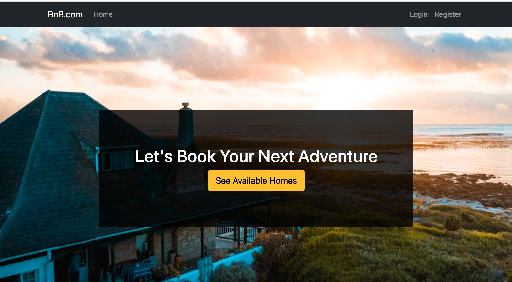

# About The Project

## This is an example of an online app that offers features such as booking a room or home, searching for a location and choosing date

---

## Built With

- [Node.js](https://nodejs.org/en/)
- [Express.js](https://expressjs.com/)
- [Passport.js](https://www.passportjs.org/)
- [Bootstrap](https://getbootstrap.com/)
- [Javescript](https://www.javascript.com/)
- [Multer](https://www.npmjs.com/package/multer)
- [Ant Design](https://ant.design/)
- [React](https://reactjs.org/)

---

# Getting Started

- Follow instructions below to have a copy of this project up and running

## Prerequisites

- Clone the repo

- https://github.com/AlhakeemALI/project-4-Backend
- https://github.com/AlhakeemALI/project-4-Backend

- Nodejs, a JavaScript runtime that lets you run applications outside the browser
- NPM, a package manager for Nodejs software packages
  (Comes with Node)
  - npm install
- MongoDB installation
- Create .env file

# Features

- User can create account and sign in

# MVP / User Stories

- As a user I can register my information so I can login and logout when I want and use the app
- As a user I can logout from my account
- As a user I can delete my post
- As a user I can read product details and read other users product

## Stretch Goals
